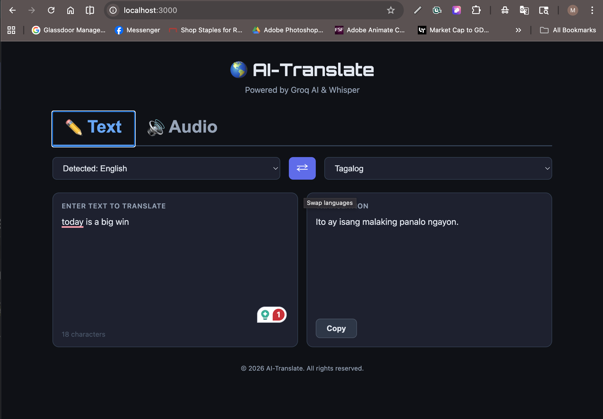
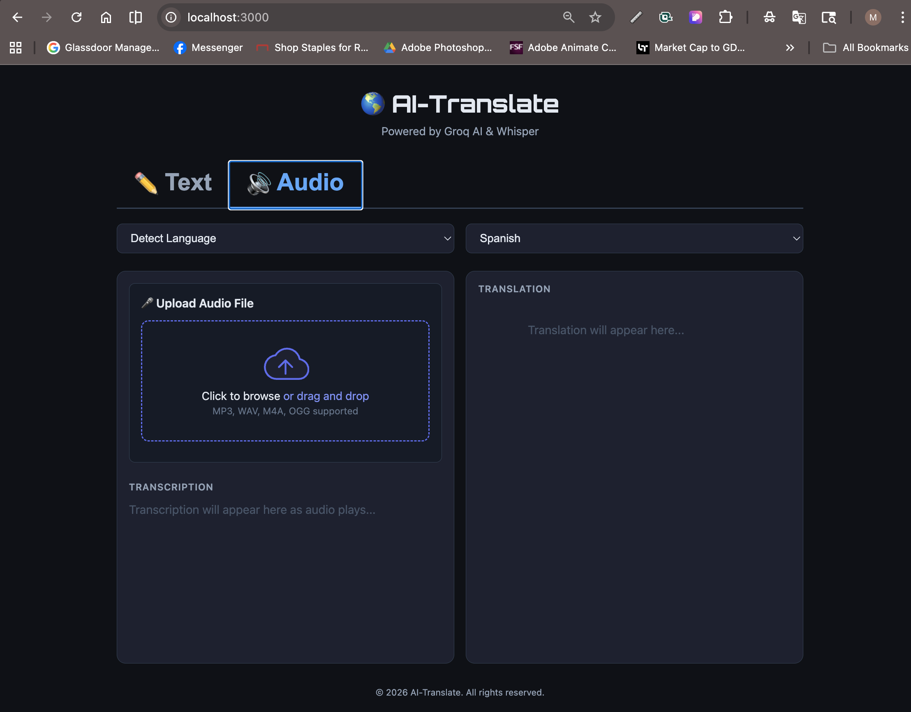

# AI Translate — Capstone Project

An agentic AI translation system powered by **Groq AI** and **OpenAI Whisper**, with real-time conversational translation for paired devices.

---

## 🎯 Features

### 📝 Text Translation

Instant translation of typed text with live language detection and typewriter-style output animation.

### 🎙️ Audio Translation

Upload audio files for transcription + translation with word-level synchronization to audio playback and quality review.

### 🔴 Live Translation

Real-time speech recognition and translation with streaming results.

### 💬 Live Conversation *(NEW)*

Two users on separate phones/devices connect via room codes and have a real-time conversation where each user sees the exchange entirely in their own language. Full WebSocket-powered streaming with zero perceptible delay.

---

## Tab Navigation

The app features **four tabs** for different translation modes:

### Tab 1: Text



- Type or paste text
- Auto-detect source language
- Live translation on every keystroke
- Swap languages button
- Copy translation to clipboard

### Tab 2: Audio



- Drag and drop audio file (MP3, WAV, M4A, OGG)
- Word-level transcription synced to playback
- Full translation with quality review
- Shows original + translation side-by-side

### Tab 3: Live

- **Mic button** to start/stop listening
- Browser-based speech recognition
- Streaming transcription display
- Live translation output
- Reset button to clear session

### Tab 4: Conversation *(NEW)*

Real-time multi-user translation flow:

- **Setup Screen** — Enter your name, select your language, create or join a room
- **Waiting Screen** — Share the 6-character room code with your partner
- **Active Conversation Screen** — See both participants' names + languages, press YOUR mic to speak, watch translations appear in real-time

## Technology Stack

### Backend

| Technology | Version | Role |
| --- | --- | --- |
| **Python** | 3.12+ | Runtime |
| **FastAPI** | ≥0.135 | REST API framework and async server |
| **Uvicorn** | ≥0.34 | ASGI server that runs the FastAPI application |
| **Groq SDK** | ≥1.1 | Client for the Groq AI inference API |
| **OpenAI Whisper** | ≥20250625 | Local speech-to-text model with word-level timestamps |
| **Lingua** | ≥2.2 | High-accuracy language detection for the live detection endpoint |
| **langdetect** | ≥1.0.9 | Language detection used inside the translation pipeline |
| **python-dotenv** | ≥1.2.2 | Loads environment variables from `.env` at runtime |
| **python-multipart** | ≥0.0.22 | Enables multipart file uploads in FastAPI |
| **ffmpeg** | system | Audio decoding required by Whisper (install via `brew install ffmpeg`) |

### AI Models

| Model | Provider | Role |
| --- | --- | --- |
| **llama-3.3-70b-versatile** | Groq / Meta | Text translation via chat completion (configurable via `GROQ_MODEL` in `.env`) |
| **Whisper base** | OpenAI | Offline speech transcription with word timestamps |

### Frontend

| Technology | Role |
| --- | --- |
| **HTML5 / CSS3 / Vanilla JavaScript** | UI — no framework dependency |
| **Drag and Drop API** | Audio file upload via drag-and-drop zone |
| **HTMLAudioElement** | In-browser audio playback synced to live transcription |
| **Fetch API** | Async communication with the backend |

### Package Management

**uv** is used as the Python package and environment manager. It handles dependency resolution, virtual environment creation, and running scripts.

---

## Project Structure

```text
AI_CAX_110_Capstone_Project/
├── backend/
│   ├── main.py                    # FastAPI server, REST API & WebSocket endpoints
│   ├── startback.sh               # Backend start script
│   ├── agents/
│   │   ├── __init__.py
│   │   ├── orchestrator.py        # Unified pipeline coordinator (text & audio)
│   │   ├── transcription_agent.py # Groq Whisper API for speech-to-text
│   │   ├── language_detection_agent.py # langdetect for language identification
│   │   ├── translation_agent.py   # Groq LLM for translation
│   │   └── quality_review_agent.py # Quality check + retry on failures
│   ├── .env.model                 # Documents the GROQ_MODEL env var value
│   └── .env.example
├── frontend/
│   ├── index.html                 # UI with 4 tabs (Text, Audio, Live, Conversation)
│   ├── styles.css                 # Dark-theme styling
│   ├── app.js                     # API calls, WebSocket logic, UI interactions
│   ├── startfront.sh              # Frontend start script
│   └── __tests__/
│       └── app.test.js            # Frontend unit tests
└── assets/
    ├── Text_screen.png            # Screenshot of Text tab
    ├── Audio_screen.png           # Screenshot of Audio tab
    └── Sample Audio.m4a           # Sample audio file for testing
```

---

# How to Run

## Setup

### 1. System Dependency

```bash
brew install ffmpeg
```

### 2. Backend

```bash
cd backend
cp .env.example .env
# Edit .env and add your GROQ_API_KEY
./startback.sh
```

Get a free Groq API key at [console.groq.com](https://console.groq.com)

### 3. Frontend

```bash
cd frontend
./startfront.sh
# Then open http://localhost:3000
```

---

## API Endpoints

### REST Endpoints

| Method | Endpoint | Description |
| --- | --- | --- |
| GET | `/create_room` | Generate a new 6-character room code for live conversation |
| POST | `/translate_text?source=es&target=en&text=...` | Translate plain text |
| POST | `/translate_audio?source=es&target=en` + file | Translate spoken audio with quality review |
| POST | `/detect_language?text=...` | Detect language of text |

### WebSocket Endpoint

| Protocol | Endpoint | Description |
| --- | --- | --- |
| WS | `/ws/conversation/{room_id}` | Real-time paired conversation. Each user sends their speech via JSON messages; server translates and broadcasts to both participants. |

**WebSocket Message Format:**

Client → Server:

```json
{"type": "join", "name": "Alice", "language": "en"}
{"type": "speech", "text": "Hello world", "is_final": true}
{"type": "interim", "text": "Hel..."}
```

Server → Client:

```json
{"type": "joined", "position": 0, "room": "ABC123"}
{"type": "paired", "users": [{"name": "Alice", "language": "en"}, {"name": "Bob", "language": "es"}]}
{"type": "message", "from": "Alice", "original": "Hello", "translation": "Hola", "is_self": false}
{"type": "interim", "from": "Alice", "text": "Hel..."}
{"type": "partner_left"}
```

Interactive docs: [http://127.0.0.1:8000/docs](http://127.0.0.1:8000/docs)

---

## Agentic Pipeline

### Text & Audio Translation

```text
Input (text or audio)
       ↓
Detect audio vs text
       ↓
Whisper speech-to-text  (audio only — word timestamps for live sync)
       ↓
Language detection (langdetect)
       ↓
Groq AI translation (llama-3.3-70b-versatile)
       ↓
Quality review (audio only — retry on failure)
       ↓
Return result
```

### Live Conversation Translation

```text
User A (English)                    User B (Spanish)
    ↓                                   ↓
Speech Recognition (Browser)        Speech Recognition (Browser)
    ↓                                   ↓
    └──→ WebSocket → Backend ←───────┘
             ↓
    Groq Translation (EN→ES & ES→EN)
             ↓
    Broadcast to both users
             ↓
User A sees: Spanish→English    User B sees: English→Spanish
```

Each user sees the **entire conversation in their own language** with original text shown for context.

---

## Supported Languages

English · Spanish · French · German · Italian · Portuguese · Chinese · Japanese · Korean · Arabic · Russian · Hindi · Dutch · Polish · Turkish · **Tagalog**

---

## Testing

### Sample Audio Upload

A sample audio file is included in the `assets/` folder for testing the audio translation feature:

> 🔊 [Sample Audio.m4a](assets/Sample%20Audio.m4a)

**How to use it:**

1. Start both the backend and frontend servers (see [How to Run](#how-to-run) above).
2. In the browser, click the **Audio** tab.
3. Drag and drop `assets/Sample Audio.m4a` onto the upload zone, or click to browse and select it.
4. Choose a **Target Language** from the dropdown.
5. Click **Translate** — Whisper will transcribe the speech and Groq AI will translate it.

The file is located at:

```text
assets/
└── Sample Audio.m4a   ← use this file for upload testing
```

### Live Conversation (Multi-Device Testing)

Test the real-time conversation feature with two devices or two browser windows:

**Device A (Alice, English speaker):**

1. Open the app and go to the **Conversation** tab
2. Enter name: `Alice`
3. Select language: `English`
4. Click **Create Room**
5. Note the room code (e.g., `ABC123`)

**Device B (Bob, Spanish speaker):**

1. Open the app and go to the **Conversation** tab
2. Enter name: `Bob`
3. Select language: `Spanish`
4. Enter the room code from Device A: `ABC123`
5. Click **Join**

**After pairing:**

- Both devices show a **Conversation Screen** with two mic buttons
- Alice sees a green pulsing mic button (hers), a gray button (Bob's)
- Bob sees a gray button (Alice's), a green pulsing mic button (his)
- When Alice clicks her mic and speaks English, Bob sees the Spanish translation in real-time
- When Bob clicks his mic and speaks Spanish, Alice sees the English translation in real-time
- Each user sees **the entire conversation in their own language** with original text in smaller text below

**Example flow:**

```text
Alice (English):        Bob (Spanish):
Press mic              (waiting)
"Hello, how are        
 you?"                 Sees: "Hola, ¿cómo estás?"
                       Press mic
                       "Estoy bien, gracias"
Sees: "I'm doing       
 well, thanks"         (continues conversation)
```

---

## Recent Fixes & Improvements

| Area | Change |
| --- | --- |
| **Swap button** | After swapping, the new input text is immediately re-translated in the new language direction |
| **Language prompt** | Translator now sends full language names (e.g. `"Tagalog"` instead of `"tl"`) so the LLM always resolves the target correctly |
| **AI model** | Upgraded from `llama-3.1-8b-instant` to `llama-3.3-70b-versatile` for significantly better multilingual accuracy, including Tagalog |
| **Model config** | Model is now configurable via the `GROQ_MODEL` environment variable in `.env` |

---

## Sample Inputs

### Korean

```text
사회초년생 포섭해 허위 임대차 계약서 꾸며 85억 대출받아
```

### Japanese

```text
「NHKやさしいことばニュース」は、日本に住んでいる外国人の皆さんや、子どもたちに、できるだけやさしい日本語でニュースを伝えるサイトです。
```

### Polish

```text
W poniedziałkowym notowaniu światowego rankingu tenisistek Iga Świątek spadła z drugiego na trzecie miejsce, wyprzedziła ją Kazaszka Jelena Rybakina.
```

---

## Screenshots

The app includes four main tabs with distinct UIs:

### 📸 To Capture Screenshots

1. Start the backend and frontend servers
2. Open `http://localhost:3000` in your browser
3. Navigate to each tab and capture:

   - **Text Tab**: Shows input/output panels side-by-side with language selectors and swap button
   - **Audio Tab**: Shows file upload drop zone, audio player, transcription, and translation
   - **Live Tab**: Shows mic button, live transcript, and translation output
   - **Conversation Tab**: Shows room setup → waiting → conversation with dual mic controls

Screenshots should be saved as:
- `assets/Text_screen.png`
- `assets/Audio_screen.png`
- `assets/Live_screen.png` (new)
- `assets/Conversation_screen.png` (new)

---

## Codespaces Secret Key

Store your `GROQ_API_KEY` as a GitHub Codespaces secret so it is automatically injected into the environment when you open the project in a Codespace — no `.env` file needed.


