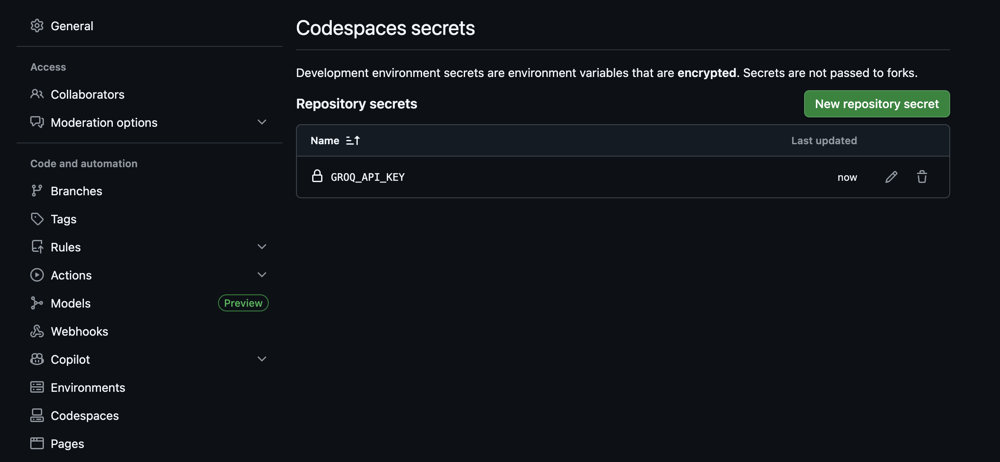

# AI Translate — Capstone Project

An agentic AI translation system powered by **Groq AI** and **OpenAI Whisper**.

---

## Technology Stack

### Backend

| Technology | Version | Role |
| --- | --- | --- |
| **Python** | 3.12+ | Runtime |
| **FastAPI** | ≥0.135 | REST API framework and async server |
| **Uvicorn** | ≥0.34 | ASGI server that runs the FastAPI application |
| **Groq SDK** | ≥1.1 | Client for the Groq AI inference API |
| **OpenAI Whisper** | ≥20250625 | Local speech-to-text model with word-level timestamps |
| **Lingua** | ≥2.2 | High-accuracy language detection for the live detection endpoint |
| **langdetect** | ≥1.0.9 | Language detection used inside the translation pipeline |
| **python-dotenv** | ≥1.2.2 | Loads environment variables from `.env` at runtime |
| **python-multipart** | ≥0.0.22 | Enables multipart file uploads in FastAPI |
| **ffmpeg** | system | Audio decoding required by Whisper (install via `brew install ffmpeg`) |

### AI Models

| Model | Provider | Role |
| --- | --- | --- |
| **llama-3.1-8b-instant** | Groq / Meta | Text translation via chat completion |
| **Whisper base** | OpenAI | Offline speech transcription with word timestamps |

### Frontend

| Technology | Role |
| --- | --- |
| **HTML5 / CSS3 / Vanilla JavaScript** | UI — no framework dependency |
| **Drag and Drop API** | Audio file upload via drag-and-drop zone |
| **HTMLAudioElement** | In-browser audio playback synced to live transcription |
| **Fetch API** | Async communication with the backend |

### Package Management

**uv** is used as the Python package and environment manager. It handles dependency resolution, virtual environment creation, and running scripts.

---

## Project Structure

```text
AI_CAX_110_Capstone_Project/
├── backend/
│   ├── main.py          # FastAPI server & API endpoints
│   ├── agent.py         # Agentic translation pipeline
│   ├── translator.py    # Groq AI translation tool
│   ├── speech.py        # Whisper speech-to-text tool
│   ├── startback.sh     # Backend start script
│   └── .env.example
└── frontend/
    ├── index.html        # UI with tab navigation, language dropdowns & text input
    ├── styles.css        # Dark-theme styling
    ├── app.js            # API calls & UI logic
    └── startfront.sh     # Frontend start script
```

---

# How to Run

## Setup

### 1. System Dependency

```bash
brew install ffmpeg
```

### 2. Backend

```bash
cd backend
cp .env.example .env
# Edit .env and add your GROQ_API_KEY
./startback.sh
```

Get a free Groq API key at [console.groq.com](https://console.groq.com)

### 3. Frontend

```bash
cd frontend
./startfront.sh
# Then open http://localhost:3000
```

---

## API Endpoints

| Method | Endpoint | Description |
| --- | --- | --- |
| POST | `/translate_text?source=es&target=en&text=...` | Translate plain text |
| POST | `/translate_audio?source=es&target=en` + file | Translate spoken audio |
| POST | `/detect_language?text=...` | Detect language of text (used for live detection) |

Interactive docs: [http://127.0.0.1:8000/docs](http://127.0.0.1:8000/docs)

---

## Agentic Pipeline

```text
Input (text or audio)
       ↓
Detect audio vs text
       ↓
Whisper speech-to-text  (audio only — word timestamps for live sync)
       ↓
Lingua language detection
       ↓
Groq AI translation (llama-3.1-8b-instant)
       ↓
Return result
```

---

## Supported Languages

English · Spanish · French · German · Italian · Portuguese · Chinese · Japanese · Korean · Arabic · Russian · Hindi · Dutch · Polish · Turkish · **Tagalog**

---

## Sample Inputs

### Korean

```text
사회초년생 포섭해 허위 임대차 계약서 꾸며 85억 대출받아
```

### Japanese

```text
「NHKやさしいことばニュース」は、日本に住んでいる外国人の皆さんや、子どもたちに、できるだけやさしい日本語でニュースを伝えるサイトです。
```

### Polish

```text
W poniedziałkowym notowaniu światowego rankingu tenisistek Iga Świątek spadła z drugiego na trzecie miejsce, wyprzedziła ją Kazaszka Jelena Rybakina.
```

---

## Codespaces Secret Key

Store your `GROQ_API_KEY` as a GitHub Codespaces secret so it is automatically injected into the environment when you open the project in a Codespace — no `.env` file needed.


