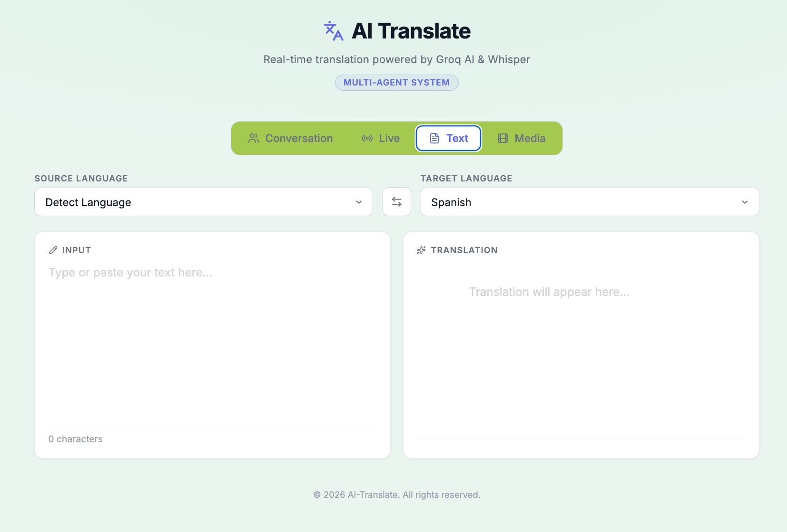
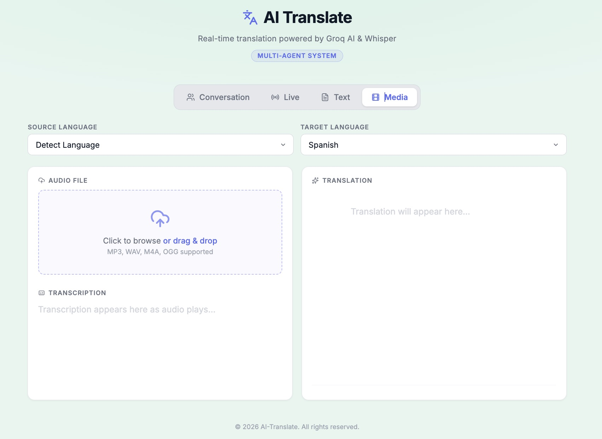
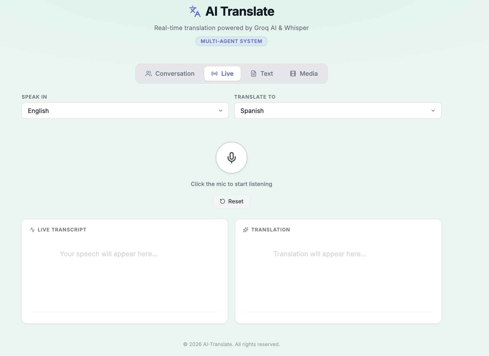
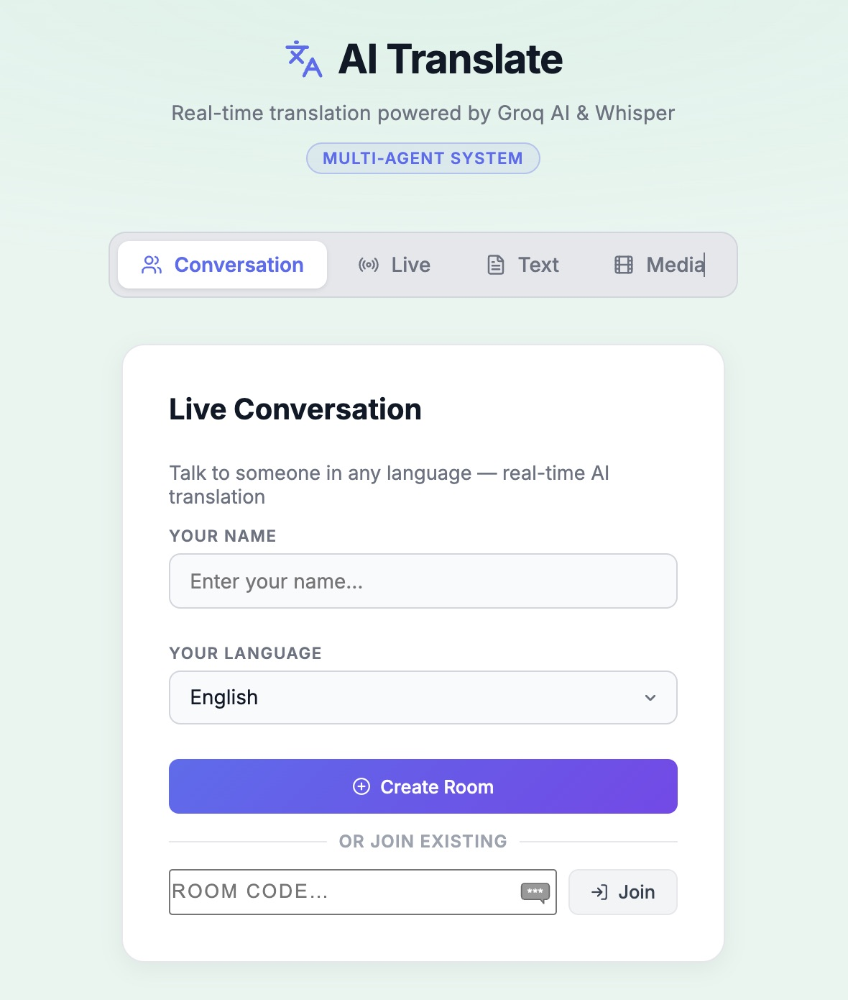

# AI Translate — Capstone Project

An agentic AI translation system powered by **Groq AI** and **OpenAI Whisper**, with real-time multi-user conversational translation, live WebRTC video/audio streaming, and anti-hallucination guardrails.

🔗 **Live App:** [https://ai-cax-110-capstone-project.onrender.com](https://ai-cax-110-capstone-project.onrender.com)

---

## Features

### Text Translation

Instant translation of typed text with live language detection and typewriter-style output animation.

### Audio Translation

Upload audio files for transcription + translation with word-level synchronization to audio playback and quality review.

### Live Translation

Real-time speech recognition and translation with streaming results.

### Live Conversation

Multi-user real-time conversation room where each participant speaks and reads in their own language. Powered by WebSockets, WebRTC, and a per-message anti-hallucination pipeline.

**Conversation highlights:**

- **Room codes** — create or join a room with a 6-character code
- **Invite / Share modal** — share the room link via Copy, SMS, Email, WhatsApp, Teams, Messenger, Telegram, Slack, or Discord
- **Unlimited participants** — every user is colour-coded for instant visual identification
- **Live WebRTC video** — open your camera to broadcast video to all participants; streams auto-play without requiring a click
- **Live WebRTC audio** — unmute your mic to stream live audio to all participants via Web Audio API
- **Keyboard input** — type messages as an alternative to speaking
- **Participant chips** — show each user's name, language name, language code badge, mic status dot, and camera status dot
- **Colour-coded message bubbles** — each participant has a unique persistent colour applied to their avatar, chip accent, and bubble
- **"Show original" toggle** — tap any translated bubble to reveal the original source text, tap again to return to the translation
- **Live caption overlay** — interim speech text and final translations appear as overlays on each participant's remote video tile
- **Anti-hallucination pipeline** — every spoken and typed message passes through a 4-stage quality-checked agent pipeline before delivery

---

## Tab Navigation

The app has **four tabs** for different translation modes.

### Tab 1: Text



- Type or paste text
- Auto-detect source language
- Live translation on every keystroke
- Swap languages button
- Copy translation to clipboard

### Tab 2: Audio



- Drag and drop audio file (MP3, WAV, M4A, OGG)
- Word-level transcription synced to playback
- Full translation with quality review
- Shows original + translation side-by-side

### Tab 3: Live



- Mic button to start/stop listening
- Browser-based speech recognition
- Streaming transcription display
- Live translation output
- Reset button to clear session

### Tab 4: Conversation



Real-time multi-user translation room:

- **Setup screen** — enter name, select language, create or join a room
- **Active screen** — participant chips bar, live video grid, message feed, mic/camera controls, keyboard input row
- Each participant sees the full conversation translated into their own language

---

## Agentic Pipeline

### Text Pipeline

```text
Input text
    ↓
Language Detection Agent
    ↓
Translation Agent  (temperature 0.3)
    ↓
Return result
```

### Conversation Pipeline (per message, per recipient)

Every spoken or typed message in the Conversation tab passes through the full anti-hallucination pipeline before it is delivered to each participant:

```text
Raw speech / keyboard text
         ↓
Conversation Agent
  └─ strip English filler words (um, uh, like, you know, …)
  └─ normalise whitespace
         ↓
Language Detection Agent
  └─ confirm source language; correct if mis-detected
         ↓
Translation Agent  (strict mode — system prompt + temperature 0)
  └─ "NEVER add, remove, or change information"
  └─ "Output ONLY the translated text"
         ↓
Quality Review Agent
  └─ checks for hallucination, added content, language errors
  └─ passes → deliver translation
  └─ fails → retry Translation Agent with critique attached
         ↓
Deliver to recipient
```

### Audio Pipeline

```text
Audio file
    ↓
Transcription Agent  (Groq Whisper — word timestamps)
    ↓
Language Detection Agent
    ↓
Translation Agent
    ↓
Quality Review Agent  →  retry with critique if flagged
    ↓
Return result
```

---

## Technology Stack

### Backend

| Technology | Version | Role |
| --- | --- | --- |
| **Python** | 3.12+ | Runtime |
| **FastAPI** | ≥0.135 | REST API + async WebSocket server |
| **Uvicorn** | ≥0.34 | ASGI server |
| **Groq SDK** | ≥1.1 | Client for Groq AI inference (LLM + Whisper) |
| **OpenAI Whisper** | ≥20250625 | Local speech-to-text with word-level timestamps |
| **Lingua** | ≥2.2 | High-accuracy language detection |
| **langdetect** | ≥1.0.9 | Language detection inside translation pipeline |
| **python-dotenv** | ≥1.2.2 | Loads `.env` at runtime |
| **python-multipart** | ≥0.0.22 | Multipart file uploads |
| **ffmpeg** | system | Audio decoding for Whisper (`brew install ffmpeg`) |

### AI Models

| Model | Provider | Role |
| --- | --- | --- |
| **llama-3.3-70b-versatile** | Groq / Meta | Text translation — configurable via `GROQ_MODEL` in `.env` |
| **Whisper base** | OpenAI | Offline speech transcription with word timestamps |

### Frontend

| Technology | Role |
| --- | --- |
| **HTML5 / CSS3 / Vanilla JS** | UI — no framework |
| **Web Speech API** (`SpeechRecognition`) | Real-time speech-to-text in the browser |
| **WebRTC** (`RTCPeerConnection`) | Peer-to-peer live video + audio between participants; mesh topology with Google STUN |
| **Web Audio API** (`AudioContext`) | Routes remote WebRTC audio tracks to speakers without autoplay restrictions |
| **WebSocket API** | Signalling channel for room events and WebRTC offer/answer/ICE exchange |
| **Web Share API** | Native share sheet on mobile for the invite modal |
| **Lucide Icons** | SVG icon set for mic, camera, share, and control buttons |
| **Drag and Drop API** | Audio file upload |
| **Fetch API** | Async REST calls to the backend |

### Package Management

**uv** is used as the Python package and environment manager.

---

## Multi-Agent Architecture

```text
backend/agents/
├── orchestrator.py            # Routes requests to the correct pipeline
├── conversation_agent.py      # Strips fillers, normalises whitespace
├── keyboard_agent.py          # Normalises keyboard input whitespace
├── language_detection_agent.py # Identifies source language
├── translation_agent.py       # Groq LLM translation (standard + strict modes)
├── quality_review_agent.py    # Hallucination detection + critique
└── transcription_agent.py     # Groq Whisper speech-to-text
```

**Strict translation mode** (`strict=True`):
- Adds a system-level prompt: *"NEVER add, remove, or change any information. Output ONLY the translated text."*
- Sets `temperature=0` for deterministic output
- Used for all conversation messages to eliminate hallucination

---

## Project Structure

```text
AI_CAX_110_Capstone_Project/
├── backend/
│   ├── main.py                         # FastAPI server — REST, WebSocket, WebRTC relay
│   ├── startback.sh                    # Backend start script
│   └── agents/
│       ├── __init__.py
│       ├── orchestrator.py             # Pipeline coordinator
│       ├── conversation_agent.py       # Filler removal + whitespace normalisation
│       ├── keyboard_agent.py           # Keyboard input normalisation
│       ├── transcription_agent.py      # Groq Whisper speech-to-text
│       ├── language_detection_agent.py # Language identification
│       ├── translation_agent.py        # Groq LLM translation (standard + strict)
│       └── quality_review_agent.py     # Quality check + retry
├── frontend/
│   ├── index.html                      # UI — 4 tabs, conversation room, invite modal
│   ├── styles.css                      # Professional light theme
│   ├── app.js                          # WebSocket, WebRTC, Speech API, UI logic
│   ├── startfront.sh                   # Frontend start script
│   └── __tests__/
│       └── app.test.js                 # Frontend unit tests
└── assets/
    ├── text_screen.jpeg
    ├── audio_screen.jpeg
    ├── live_screen.jpeg
    ├── conversation_screen.jpeg
    └── Sample Audio.m4a
```

---

## How to Run

### 1. System Dependency

```bash
brew install ffmpeg
```

### 2. Backend

```bash
cd backend
cp .env.example .env
# Edit .env and add your GROQ_API_KEY
./startback.sh
```

Get a free Groq API key at [console.groq.com](https://console.groq.com)

### 3. Frontend

```bash
cd frontend
./startfront.sh
# Open http://localhost:3000
```

---

## API Reference

### REST Endpoints

| Method | Endpoint | Description |
| --- | --- | --- |
| GET | `/create_room` | Generate a new 6-character room code |
| POST | `/translate_text?source=es&target=en&text=...` | Translate plain text |
| POST | `/translate_audio?source=es&target=en` + file | Translate spoken audio |
| POST | `/detect_language?text=...` | Detect language of text |

### WebSocket Endpoint

| Protocol | Endpoint | Description |
| --- | --- | --- |
| WS | `/ws/conversation/{room_id}` | Real-time multi-user conversation room |

**Client → Server messages:**

```json
{"type": "join",          "name": "Alice", "language": "en"}
{"type": "speech",        "text": "Hello world", "is_final": true}
{"type": "interim",       "text": "Hel..."}
{"type": "keyboard",      "text": "Hello via keyboard"}
{"type": "mic_status",    "is_on": true}
{"type": "camera_status", "is_on": true}
{"type": "webrtc_offer",  "target_id": "XYZ", "sdp": "..."}
{"type": "webrtc_answer", "target_id": "XYZ", "sdp": "..."}
{"type": "webrtc_ice",    "target_id": "XYZ", "candidate": {...}}
```

**Server → Client messages:**

```json
{"type": "joined",       "user_id": "...", "room": "ABC123", "is_host": true, "users": [...]}
{"type": "user_joined",  "user": {"user_id": "...", "name": "Bob", "language": "es", ...}}
{"type": "user_left",    "user_id": "...", "name": "Bob"}
{"type": "message",      "from_id": "...", "from": "Bob", "original": "Hola", "translation": "Hello", "is_self": false}
{"type": "interim",      "from_id": "...", "from": "Bob", "text": "Hol..."}
{"type": "user_mic_status",    "user_id": "...", "is_on": true}
{"type": "user_camera_status", "user_id": "...", "is_on": true}
{"type": "host_changed", "new_host_id": "..."}
{"type": "webrtc_offer",  "from_id": "...", "sdp": "..."}
{"type": "webrtc_answer", "from_id": "...", "sdp": "..."}
{"type": "webrtc_ice",    "from_id": "...", "candidate": {...}}
```

---

## Supported Languages

English · Spanish · French · German · Italian · Portuguese · Chinese · Japanese · Korean · Arabic · Russian · Hindi · Dutch · Polish · Turkish · **Tagalog**

---

## Testing

### Audio Upload

A sample audio file is included for testing:

> [assets/Sample Audio.m4a](assets/Sample%20Audio.m4a)

1. Start backend and frontend servers
2. Go to the **Audio** tab
3. Drag and drop `Sample Audio.m4a` onto the upload zone
4. Choose a target language and click **Translate**

### Live Conversation (Multi-Device)

Test the real-time conversation feature using two different devices or two **Chrome/Firefox** tabs (see browser note below).

**Participant A:**
1. Go to the **Conversation** tab
2. Enter a name, select a language, click **Create Room**
3. Share the 6-character room code (or use the Invite button)

**Participant B:**
1. Go to the **Conversation** tab
2. Enter a name, select a language, enter the room code, click **Join**

**After joining:**
- Unmute mic to speak — speech is transcribed, cleaned, translated, quality-reviewed, and delivered to every other participant in their language
- Open camera to broadcast live video to all participants
- Type in the keyboard bar to send text messages without speaking
- Tap any received message to toggle between translation and original text

### Browser Compatibility Note

| Browser | Multi-tab mic | Recommended |
| --- | --- | --- |
| **Chrome** | Yes — multiple tabs can use the mic simultaneously | Best for local testing |
| **Firefox** | Yes | Supported |
| **Safari** | No — only one tab holds the mic at a time | Use separate devices |

> **Safari limitation:** Safari enforces exclusive microphone access per browser window. If you open two Safari tabs to simulate two participants on the same machine, the second tab will be denied mic access. This is a Safari restriction — on real separate devices it is not an issue. Use Chrome or Firefox for local multi-tab testing.

---

## Recent Changes

| Area | Change |
| --- | --- |
| **Anti-hallucination pipeline** | All conversation messages (speech + keyboard) pass through ConversationAgent → strict TranslationAgent (temperature 0) → QualityReviewAgent → retry with critique |
| **ConversationAgent** | Strips English filler words (um, uh, like, you know…) and normalises whitespace before translation |
| **TranslationAgent strict mode** | System-level prompt + `temperature=0` for deterministic, faithful translations |
| **WebRTC video + audio** | Peer-to-peer live video and audio between all participants; mesh topology with Google STUN; muted `<video>` for guaranteed autoplay |
| **Web Audio API** | Remote audio routed through `AudioContext → createMediaStreamSource` to bypass browser autoplay restrictions |
| **Participant colour coding** | 8-colour palette assigned persistently per participant; applied to chip avatar, chip border, bubble name, bubble border, and video tile border |
| **"Show original" toggle** | Button on every translated bubble to flip between translated and source text |
| **Language code badge** | Short code (e.g. `ES`, `ZH`) displayed beside participant name in the chip bar |
| **Live caption overlay** | Interim speech and final translated text shown as overlay on each remote video tile; clears after 4 seconds |
| **Keyboard input** | Text input row in conversation tab routes through the full anti-hallucination pipeline |
| **Invite / Share modal** | Share room link via 9 platforms: Copy, SMS, Email, WhatsApp, Teams, Messenger, Telegram, Slack, Discord |
| **Room Code label** | "Room" renamed to "Room Code" for clarity |
| **Safari mic error** | Detected and shown as a clear explanation with guidance to use Chrome for local multi-tab testing |
| **AI model** | Upgraded from `llama-3.1-8b-instant` to `llama-3.3-70b-versatile` for better multilingual accuracy |
| **Model config** | Configurable via `GROQ_MODEL` environment variable in `.env` |

---

## Codespaces Secret Key

Store your `GROQ_API_KEY` as a GitHub Codespaces secret for automatic injection — no `.env` file needed.


